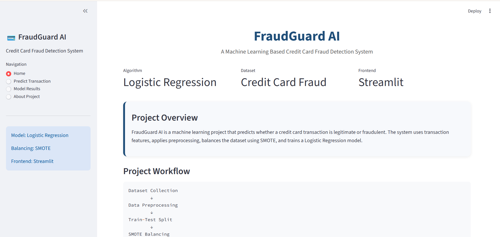
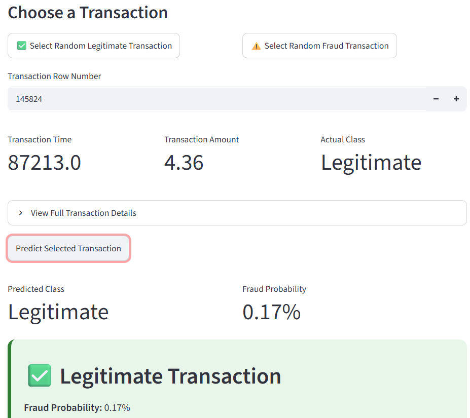
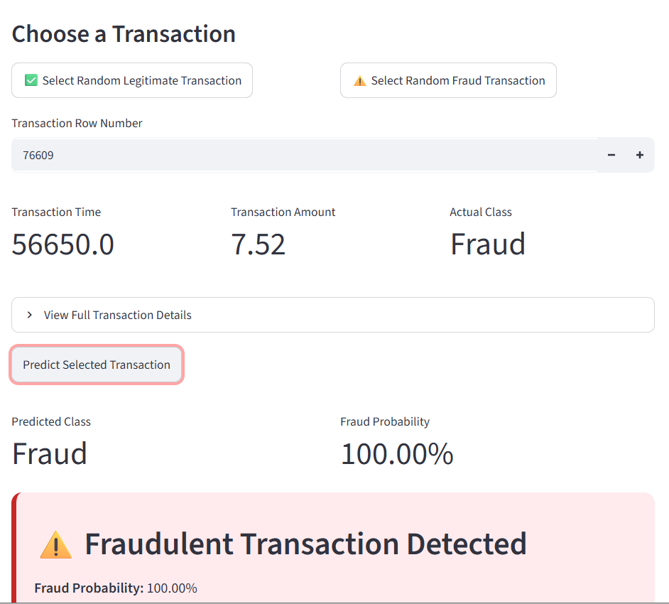
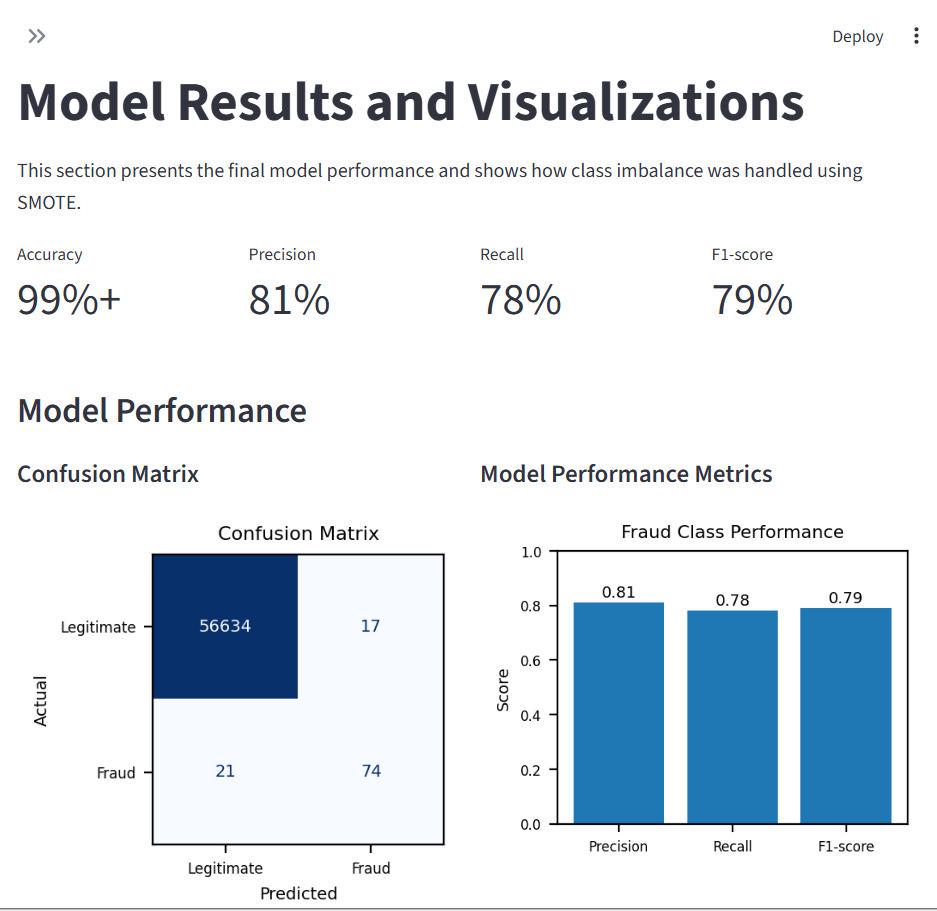

# FraudGuard AI: Credit Card Fraud Detection System

FraudGuard AI is a machine learning web application that predicts whether a credit card transaction is legitimate or fraudulent.

## Project Overview

This project uses Logistic Regression to detect credit card fraud. The dataset is highly imbalanced, so SMOTE was used to increase fraud samples in the training data. The model is integrated with a Streamlit front-end for easy interaction.

## Tech Stack

- Python
- Pandas
- NumPy
- Scikit-learn
- Imbalanced-learn
- Logistic Regression
- SMOTE
- Matplotlib
- Streamlit
- Joblib

## Dataset

The original dataset used in this project is the Kaggle Credit Card Fraud Detection dataset.

Dataset link: https://www.kaggle.com/datasets/mlg-ulb/creditcardfraud

The full dataset is not uploaded because it is large. A smaller `sample_transactions.csv` file is included for testing the Streamlit app.

## Project Workflow

Dataset Collection → Data Preprocessing → Train-Test Split → SMOTE Balancing → Logistic Regression Training → Model Evaluation → Streamlit Integration


## Model Performance

| Metric | Score |
|---|---:|
| Accuracy | 99%+ |
| Precision | 81% |
| Recall | 78% |
| F1-score | 79% |

## Confusion Matrix

| Term | Count | Meaning |
|---|---:|---|
| True Legitimate | 56,634 | Normal transactions correctly predicted as legitimate |
| False Fraud Alarm | 17 | Normal transactions wrongly marked as fraud |
| Missed Fraud | 21 | Fraud transactions wrongly predicted as legitimate |
| Correct Fraud | 74 | Fraud transactions correctly detected |

## Features

- Streamlit web interface
- Random legitimate transaction selection
- Random fraud transaction selection
- Fraud probability display
- Confusion matrix visualization
- Precision, recall, and F1-score graph
- Before/after SMOTE class distribution visualization
  
## Screenshots









## Learning Outcomes

- Data preprocessing
- Feature scaling
- Handling imbalanced datasets using SMOTE
- Logistic Regression model training
- Model evaluation using precision, recall, F1-score, and confusion matrix
- Streamlit front-end integration
  
## How to Run Locally

```bash
pip install -r requirements.txt
streamlit run app.py
